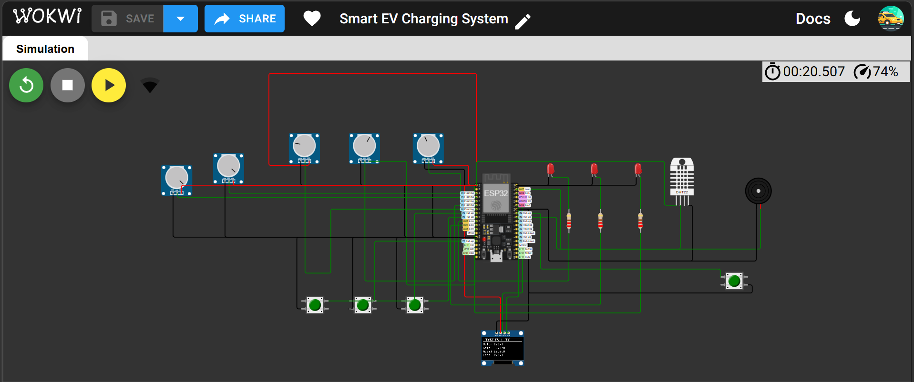
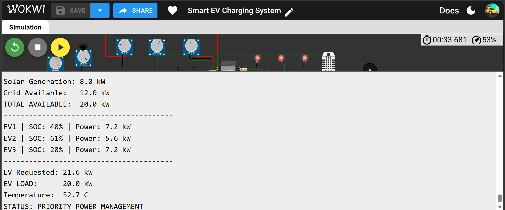
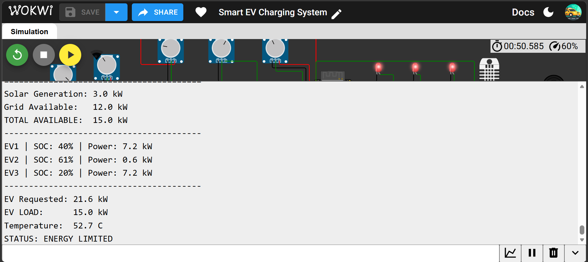
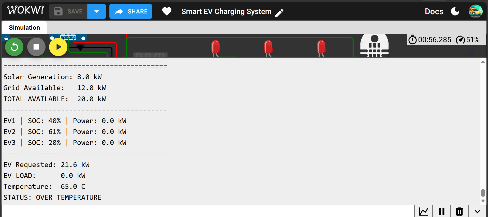
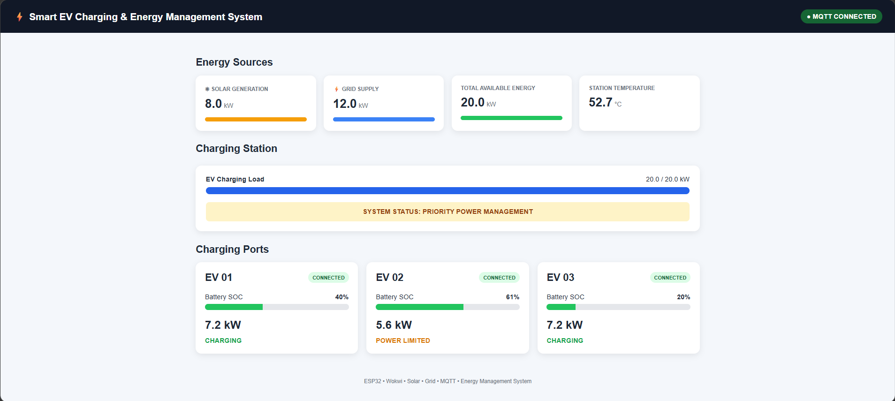

# Smart EV Charging & Renewable Energy Management System

## Overview

The **Smart EV Charging & Renewable Energy Management System** is a simulation-based ESP32 project that demonstrates intelligent management of multiple EV charging ports under limited and variable energy availability.

The system manages **three EV charging ports** and dynamically allocates charging power based on:

- Vehicle State of Charge (SOC)
- EV connection status
- Station power capacity
- Solar generation
- Grid availability
- Station temperature
- Emergency conditions

Each EV can request up to **7.2 kW**, while the charging station is limited to a maximum capacity of **20 kW**.

When total EV demand exceeds the available power, the controller applies **SOC-based priority charging**, giving higher charging priority to vehicles with a lower battery SOC.

The project also integrates simulated **solar and grid energy sources**, thermal protection, emergency-stop functionality, MQTT telemetry, and a real-time browser dashboard.

> **Note:** This is a simulation-based prototype developed using Wokwi. It does not control real high-voltage EV charging hardware.

---

## Complete System



---

## Key Features

- Three independent EV charging ports
- Simulated EV battery SOC inputs
- EV connect/disconnect control
- Maximum station capacity of **20 kW**
- Maximum charging power of **7.2 kW per EV**
- SOC-based charging priority
- Dynamic power allocation
- Simulated solar generation
- Simulated grid availability
- Automatic charging reduction when energy availability falls
- Over-temperature protection
- Emergency-stop protection
- Buzzer-based fault indication
- OLED local monitoring
- ESP32 Wi-Fi connectivity
- MQTT telemetry
- MQTT-over-WebSocket browser communication
- Real-time web dashboard
- Live system operating-state monitoring

---

## System Architecture

```text
              SOLAR             GRID
             0–8 kW           0–12 kW
                │                │
                └───────┬────────┘
                        ▼
                ┌───────────────┐
                │     ESP32     │
                │    ENERGY     │
                │  MANAGEMENT   │
                │    SYSTEM     │
                └───────┬───────┘
                        │
          ┌─────────────┼─────────────┐
          ▼             ▼             ▼
        EV01           EV02           EV03
      SOC/Power      SOC/Power      SOC/Power
          │             │             │
          └─────────────┼─────────────┘
                        ▼
               SOC-Based Priority
                  Power Allocation
                        │
          ┌─────────────┼─────────────┐
          ▼             ▼             ▼
    Temperature       E-STOP         OLED
    Protection
          │
          └─────────────┬─────────────┘
                        ▼
                      Wi-Fi
                        │
                        ▼
                       MQTT
                        │
                        ▼
                 LIVE DASHBOARD
```

---

## Simulated Hardware

| Component | Purpose |
|---|---|
| ESP32 | Main controller and energy-management logic |
| 3 × Potentiometers | Simulated EV battery SOC |
| 3 × Pushbuttons | EV connect/disconnect controls |
| 3 × LEDs | Charging-status indicators |
| 2 × Potentiometers | Simulated solar and grid availability |
| DHT22 | Simulated station temperature |
| Pushbutton | Emergency-stop input |
| Buzzer | Fault/alarm indication |
| SSD1306 OLED | Local system monitoring |
| Resistors | LED current limiting |

---

## Energy Sources

The simulated station uses two energy sources:

| Energy Source | Maximum Power |
|---|---:|
| Solar | 8 kW |
| Grid | 12 kW |
| Maximum Station Capacity | 20 kW |

The available charging power is calculated as:

```text
Available Power = Solar Power + Grid Power
```

The result is limited to the station's maximum capacity of **20 kW**.

For example:

```text
Solar = 8 kW
Grid  = 12 kW

Available Power = 20 kW
```

If solar generation falls:

```text
Solar = 3 kW
Grid  = 12 kW

Available Power = 15 kW
```

The EV charging load is automatically reduced to match the available energy.

---

## EV Charging Model

Each EV can request a maximum of:

```text
7.2 kW
```

With all three EVs connected:

```text
3 × 7.2 kW = 21.6 kW
```

However, the station can provide a maximum of:

```text
20.0 kW
```

Therefore, the controller must dynamically allocate the available power rather than allowing the total charging demand to exceed the station capacity.

---

## SOC-Based Priority Charging

Charging priority is determined by battery State of Charge.

Vehicles with a **lower SOC receive higher priority**.

Example:

```text
EV1 SOC = 40%
EV2 SOC = 61%
EV3 SOC = 20%
```

Priority order:

```text
EV3 → Highest Priority
EV1 → Second Priority
EV2 → Third Priority
```

With 20 kW available:

```text
EV3 → 7.2 kW
EV1 → 7.2 kW
EV2 → 5.6 kW

Total EV Load = 20.0 kW
```

This keeps the charging station within its power limit while prioritising vehicles with lower battery levels.

---

## Priority Power Management

When the three EVs request their full charging power:

```text
Requested EV Power = 21.6 kW
Available Power    = 20.0 kW
```

The controller prevents overload and reallocates the available energy.



Example result:

```text
EV1 | SOC: 40% | Power: 7.2 kW
EV2 | SOC: 61% | Power: 5.6 kW
EV3 | SOC: 20% | Power: 7.2 kW

EV Requested: 21.6 kW
EV Load:      20.0 kW

STATUS: PRIORITY POWER MANAGEMENT
```

---

## Renewable Energy Management

The system continuously monitors simulated solar and grid availability.

If the available energy decreases, the controller automatically reduces EV charging power.

### Solar-Drop Example

```text
Solar Generation = 3.0 kW
Grid Availability = 12.0 kW

Total Available Power = 15.0 kW
```

The controller maintains SOC priority:

```text
EV3 → 7.2 kW
EV1 → 7.2 kW
EV2 → 0.6 kW

Total EV Load = 15.0 kW
```



The system state changes to:

```text
STATUS: ENERGY LIMITED
```

This demonstrates automatic demand adaptation when renewable-energy availability decreases.

---

## Protection System

### Over-Temperature Protection

The simulated station temperature is monitored using a DHT22 sensor.

The charging system enters a thermal fault when:

```text
Temperature ≥ 60°C
```

Charging can recover after the temperature falls to approximately:

```text
Temperature ≤ 55°C
```

The difference between the shutdown and recovery temperatures provides hysteresis and helps prevent rapid switching near the thermal limit.

During an over-temperature condition:

```text
EV1 Power = 0.0 kW
EV2 Power = 0.0 kW
EV3 Power = 0.0 kW

EV Load = 0.0 kW
```

The controller also:

- switches off all charging LEDs,
- activates the buzzer,
- displays a fault warning on the OLED,
- publishes the fault state through MQTT.



Example:

```text
Solar Available = 8.0 kW
Grid Available  = 12.0 kW
Total Available = 20.0 kW

Temperature = 65.0°C

EV Load = 0.0 kW

STATUS: OVER TEMPERATURE
```

This confirms that charging is disabled due to the safety condition even when sufficient electrical power is available.

---

## Emergency Stop

A dedicated emergency-stop input immediately disables EV charging.

When activated:

```text
EV1 Power = 0.0 kW
EV2 Power = 0.0 kW
EV3 Power = 0.0 kW

Total EV Load = 0.0 kW
```

The system also:

- activates the buzzer,
- switches off charging outputs,
- displays an emergency warning,
- publishes the emergency state through MQTT.

The emergency-stop state is latched in the simulation and remains active until the simulated controller is restarted.

---

## System Operating States

| State | Description |
|---|---|
| `NORMAL` | Available energy is sufficient for the current charging demand |
| `PRIORITY POWER MANAGEMENT` | EV demand exceeds the station capacity and SOC-based allocation is applied |
| `ENERGY LIMITED` | Solar + grid availability is below total EV charging demand |
| `OVER TEMPERATURE` | Charging is disabled because the thermal safety threshold has been exceeded |
| `EMERGENCY STOP` | Charging is disabled by the emergency-stop input |

---

## IoT and MQTT Communication

The simulated ESP32 connects to Wi-Fi using Wokwi's virtual network and publishes operating data through MQTT.

The communication architecture is:

```text
Wokwi ESP32
     │
     ▼
   Wi-Fi
     │
     ▼
 MQTT Broker
     │
     ▼
Browser Dashboard
```

MQTT communication was tested using a HiveMQ MQTT broker and WebSocket client.

### Published Data

The ESP32 publishes telemetry including:

```text
EV1 SOC
EV1 Charging Power
EV1 Connection State

EV2 SOC
EV2 Charging Power
EV2 Connection State

EV3 SOC
EV3 Charging Power
EV3 Connection State

Station Load
Requested Charging Power
Station Capacity
Station Temperature
Emergency State
System Status

Solar Generation
Grid Availability
Total Available Energy
```

Example topic structure:

```text
smartEV/demo7F3A/ev1/soc
smartEV/demo7F3A/ev1/power
smartEV/demo7F3A/ev1/connected

smartEV/demo7F3A/ev2/soc
smartEV/demo7F3A/ev2/power
smartEV/demo7F3A/ev2/connected

smartEV/demo7F3A/ev3/soc
smartEV/demo7F3A/ev3/power
smartEV/demo7F3A/ev3/connected

smartEV/demo7F3A/station/load
smartEV/demo7F3A/station/temperature
smartEV/demo7F3A/station/status

smartEV/demo7F3A/energy/solar
smartEV/demo7F3A/energy/grid
smartEV/demo7F3A/energy/available
```

---

## Live Web Dashboard

A browser-based dashboard was developed using:

```text
HTML
CSS
JavaScript
MQTT over WebSockets
```

The dashboard subscribes to the MQTT data published by the ESP32 and updates automatically without requiring a page refresh.

It displays:

- MQTT connection status
- Solar generation
- Grid supply
- Total available energy
- Station temperature
- Total EV charging load
- Station capacity
- Current system operating state
- EV1 battery SOC and charging power
- EV2 battery SOC and charging power
- EV3 battery SOC and charging power
- EV connection states
- Power-limited charging indication



Example dashboard condition:

```text
Solar Generation:     8.0 kW
Grid Supply:          12.0 kW
Available Energy:     20.0 kW
Station Temperature:  52.7°C

EV Load:              20.0 / 20.0 kW

EV1: 40% → 7.2 kW
EV2: 61% → 5.6 kW
EV3: 20% → 7.2 kW

STATUS: PRIORITY POWER MANAGEMENT
```

---

## MQTT Dashboard Data Flow

```text
                  WOKWI SIMULATION
                         │
                         ▼
                       ESP32
                         │
                  Sensor / SOC Data
                         │
                         ▼
                  Energy Management
                         │
                         ▼
                       Wi-Fi
                         │
                         ▼
                    MQTT Broker
                         │
                 MQTT WebSockets
                         │
                         ▼
                 Browser Dashboard
```

---

## Project Development Stages

The system was developed progressively through six stages.

### Phase 1 — Single EV Charging

Implemented:

```text
Single EV
SOC simulation
Connection control
Charging LED
OLED monitoring
```

### Phase 2 — Three EV Charging Ports

Expanded the controller to support:

```text
EV1
EV2
EV3
```

with independent SOC, connection controls and charging indicators.

### Phase 3 — Smart Power Allocation

Implemented:

```text
20 kW station limit
Dynamic charging allocation
SOC-based charging priority
```

### Phase 4 — Protection System

Added:

```text
Temperature monitoring
Over-temperature shutdown
Emergency stop
Buzzer fault indication
```

### Phase 5 — IoT Monitoring

Added:

```text
ESP32 Wi-Fi
MQTT telemetry
MQTT WebSocket communication
Live browser dashboard
```

### Phase 6 — Renewable Energy Management

Added:

```text
Solar power simulation
Grid power simulation
Dynamic available-energy calculation
Automatic charging reduction
ENERGY LIMITED operating state
```

---

## Technologies Used

| Technology | Purpose |
|---|---|
| ESP32 | Embedded controller |
| Arduino / C++ | Firmware development |
| Wokwi | Embedded-system simulation |
| MQTT | IoT messaging |
| HiveMQ | MQTT broker/testing |
| Wi-Fi | Network communication |
| HTML | Dashboard structure |
| CSS | Dashboard styling |
| JavaScript | Dashboard logic |
| MQTT over WebSockets | Browser MQTT communication |
| DHT22 | Temperature simulation |
| SSD1306 OLED | Local display |

---

## Required Arduino Libraries

The Wokwi project uses:

```text
Adafruit GFX Library
Adafruit SSD1306
DHT sensor library
ArduinoMqttClient
```

These are included in:

```text
libraries.txt
```

---

## Project Structure

```text
Smart-EV-Charging-EMS/
│
├── firmware/
│   └── sketch.ino
│
├── dashboard/
│   └── index.html
│
├── wokwi/
│   └── diagram.json
│
├── screenshots/
│   ├── 01-complete-wokwi-circuit.png
│   ├── 02-priority-power-management.png
│   ├── 03-solar-drop-energy-limited.png
│   ├── 04-over-temperature-fault.png
│   └── 05-live-dashboard.png
│
├── libraries.txt
│
└── README.md
```

---

## How to Run the Project

### 1. Open the Wokwi Simulation

Open the ESP32 project in Wokwi.

Ensure the required libraries are present in `libraries.txt`.

### 2. Start the Simulation

Run the ESP32 simulation.

The ESP32 will connect to:

```text
Wokwi-GUEST
```

and establish an MQTT connection.

### 3. Configure EV Conditions

Use the three EV SOC potentiometers to simulate different battery levels.

Use the corresponding EV buttons to connect or disconnect each vehicle.

### 4. Configure Energy Availability

Use the energy-source potentiometers to simulate:

```text
Solar: 0–8 kW
Grid:  0–12 kW
```

### 5. Test Power Management

Connect all three EVs.

When total demand exceeds available energy, the controller will automatically apply SOC-based power allocation.

### 6. Test Solar Reduction

Reduce the simulated solar generation while keeping the grid supply constant.

The system should automatically reduce charging load and enter:

```text
ENERGY LIMITED
```

when necessary.

### 7. Test Thermal Protection

Increase the DHT22 temperature above:

```text
60°C
```

Charging should stop automatically.

### 8. Open the Dashboard

Open:

```text
dashboard/index.html
```

in a web browser while the Wokwi simulation is running.

The dashboard should connect to MQTT and display live station data.

---

## Demonstrated Test Scenarios

### Scenario 1 — Priority Charging

```text
Solar = 8.0 kW
Grid  = 12.0 kW
Available = 20.0 kW

EV1 SOC = 40%
EV2 SOC = 61%
EV3 SOC = 20%

Requested Power = 21.6 kW

EV1 = 7.2 kW
EV2 = 5.6 kW
EV3 = 7.2 kW

Actual EV Load = 20.0 kW

STATUS:
PRIORITY POWER MANAGEMENT
```

### Scenario 2 — Solar Drop

```text
Solar = 3.0 kW
Grid  = 12.0 kW
Available = 15.0 kW

Requested Power = 21.6 kW

EV1 = 7.2 kW
EV2 = 0.6 kW
EV3 = 7.2 kW

Actual EV Load = 15.0 kW

STATUS:
ENERGY LIMITED
```

### Scenario 3 — Over-Temperature Protection

```text
Solar = 8.0 kW
Grid  = 12.0 kW
Available = 20.0 kW

Temperature = 65°C

Requested Power = 21.6 kW
Actual EV Load = 0.0 kW

STATUS:
OVER TEMPERATURE
```

---

## Limitations

This project is a **simulation-based embedded and energy-management prototype**.

It does not implement real high-voltage EV charging hardware.

The following elements are simulated:

- EV battery SOC
- EV charging demand
- Solar generation
- Grid availability
- Charging power
- Station temperature

The project does not currently implement:

- Real EVSE power electronics
- AC/DC or DC/DC charging converters
- Physical EV battery communication
- IEC 61851 / ISO 15118 communication
- Real current or voltage sensing
- Grid-tied solar hardware
- High-voltage relays or contactors
- Utility smart-meter integration
- Real battery-management-system communication

The project is intended to demonstrate **embedded control, intelligent power allocation, renewable-energy management, protection logic, IoT communication, and real-time monitoring**.

---

## Future Improvements

Potential future extensions include:

- Time-of-use electricity pricing
- Smart charging based on electricity tariffs
- Charging-cost calculation
- Estimated charging-completion time
- Historical power and energy graphs
- Persistent database storage
- User-selectable charging priority
- RFID/user authentication
- Remote charging control
- Renewable-generation forecasting
- EV arrival and departure scheduling
- ML-based charging-demand prediction
- Solar-generation prediction
- Battery-health-aware charging
- Vehicle-to-Grid (V2G) simulation
- Load forecasting
- Mobile-responsive control interface
- Real ESP32 hardware implementation
- Integration with real power-metering hardware
- EVSE communication and protection hardware

---

## Skills Demonstrated

This project demonstrates experience with:

```text
Embedded Systems
ESP32 Programming
Arduino / C++
IoT Systems
MQTT
Wi-Fi Communication
Real-Time Monitoring
Energy Management Systems
EV Charging Concepts
Renewable Energy Integration
Dynamic Power Allocation
Priority Algorithms
Fault Detection
Protection Logic
Sensor Integration
Web Dashboard Development
HTML / CSS / JavaScript
System Integration
Simulation and Testing
```

---

## Conclusion

The **Smart EV Charging & Renewable Energy Management System** demonstrates a complete simulation of an intelligent multi-port EV charging station.

The controller dynamically manages charging demand according to vehicle SOC, available solar and grid power, station capacity, and safety conditions.

The system successfully demonstrates:

```text
Multi-EV Charging
        +
SOC-Based Priority
        +
Dynamic Power Allocation
        +
Solar/Grid Energy Management
        +
Protection Systems
        +
IoT / MQTT Monitoring
        +
Real-Time Web Dashboard
```

The project provides a foundation for further development toward intelligent EV charging infrastructure, renewable-energy-aware charging systems, and connected energy-management applications.
